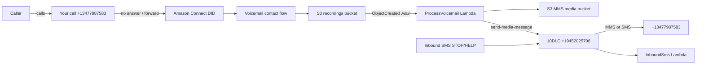

# Missed-call voicemail SMS alert (personal)

Standalone project — **not** part of PingTweets. Sends a transactional MMS (or SMS link fallback) to your phone when a forwarded missed call leaves voicemail.

## Architecture



| Component | Purpose |
|-----------|---------|
| **Your phone** | Conditional call forward (No Answer) → Connect DID |
| **Amazon Connect** | New instance + inbound US number; records voicemail to S3 |
| **S3** | Voicemail WAV storage; transcoded MP3 for MMS (30-day lifecycle) |
| **Lambda** | Transcode audio, send MMS via 10DLC, fallback to presigned link |
| **10DLC** | Outbound only: `+19452025796` / campaign `CJDA4Y5` / brand `B9JC7EP` |

**Why two phone numbers?** Your 10DLC number (`+19452025796`) is for **outbound SMS/MMS only**. Inbound voicemail needs a separate **Amazon Connect DID** (~$1/mo) that you forward unanswered calls to.

## MMS vs secure link

| Approach | UX on iPhone/Android | When used |
|----------|----------------------|-----------|
| **MMS (preferred)** | Tap message → audio plays inline in Messages | MP3 ≤ 600 KB after transcoding |
| **SMS + presigned S3 URL** | Tap link → opens in browser/player | MMS unsupported, over size limit, or carrier rejection |

**Recommendation:** Use **MMS** as primary. AWS End User Messaging supports `audio/mpeg` (MP3) up to **600 KB** per attachment on 10DLC in the US. The Lambda transcodes Connect’s WAV to 32 kbps mono MP3 via an ffmpeg Lambda layer.

**Max voicemail length:** **60 seconds** (configured in `config/defaults.json`). At 32 kbps that is ~240 KB — well under 600 KB. Going to 90–120 seconds is possible but increases MMS failure risk and Connect recording cost.

## Before you deploy (paid resources)

**Confirm with me before running `deploy.sh`** if you have not already approved these charges:

| Resource | Approx. monthly cost |
|----------|---------------------|
| Amazon Connect DID | ~$1.00 |
| Connect inbound minutes | ~$0.018/min (low volume ≈ pennies) |
| 10DLC number + campaign | Already registered (no new 10DLC fees if reusing `+19452025796`) |
| MMS per alert | ~$0.03 ($0.02 base + $0.01 carrier) |
| SMS fallback | ~$0.007–0.01 per message |
| S3 + Lambda | &lt; $1 at low volume |

**Example:** 30 missed calls/month with voicemail ≈ **$2–3** total (mostly Connect DID + MMS).

### Verify 10DLC / MMS in console

Run:

```bash
bash scripts/verify-10dlc.sh
```

Manual checks:

1. **End User Messaging → Phone numbers → `+19452025796`**
   - Status: **Active** (not Pending)
   - Capabilities: **SMS + MMS**
   - Campaign: **CJDA4Y5**
2. **Registrations → Campaign CJDA4Y5** — Complete, transactional use case
3. **Registrations → Brand B9JC7EP** — Complete
4. If your account is in the **SMS sandbox**, add `+13477987583` as a verified destination

## Phone setup (your cell)

On **iPhone**: Settings → Phone → Call Forwarding → **Forward When Unanswered** (or carrier `*71` / `*61` codes).

On **Android**: Phone app → Settings → Calling → Call forwarding → **When unanswered**.

Forward to the **Amazon Connect DID** you claim after deploy (not the 10DLC number).

Suggested behavior:

- Ring your phone **20–25 seconds** so you can answer normally.
- If unanswered, carrier forwards to Connect → greeting → record up to **60 s** → hang up.
- You receive one text with caller ID, time, and voicemail audio.

Carrier codes (varies by carrier):

- AT&T: `*61*<ConnectDID>*11*25#` — forward no-answer after 25s
- T-Mobile / Verizon: use Settings UI or `*61*<ConnectDID>#`

## Deploy

```bash
cd missed-call-voicemail-alert
bash scripts/deploy.sh
```

Post-deploy (console):

1. **Connect** → claim US phone number → assign **MissedCallVoicemail** flow → enable call recordings to the stack’s recordings bucket.
2. **End User Messaging** → `+19452025796` → two-way SMS → inbound → SNS topic from stack output `InboundSmsTopicArn`.

## Test

```bash
bash scripts/test-e2e.sh          # synthetic WAV → Lambda → MMS/SMS
# Then live: call your cell, don't answer, leave voicemail
```

## STOP / HELP compliance

Inbound SMS to `+19452025796` is routed to `InboundSms` Lambda (owner number only):

- **STOP** — pauses alerts (stored in DynamoDB)
- **START** — re-enables
- **HELP** — returns program info

## Configuration

Edit `config/defaults.json` before deploy:

- `recipientPhone`, `originationIdentity`, `maxVoicemailSeconds`, `recordingRetentionDays`

## What this does **not** touch

- PingTweets code, Lambdas, or production SMS traffic
- Any existing 10DLC campaigns beyond **sending** from your already-verified number

## Project layout

```
missed-call-voicemail-alert/
  config/defaults.json
  connect/voicemail-flow.json
  lambda/process_voicemail/    # S3 trigger → MMS/SMS
  lambda/inbound_sms/        # STOP/HELP handler
  infra/                     # AWS CDK stack
  scripts/
```
